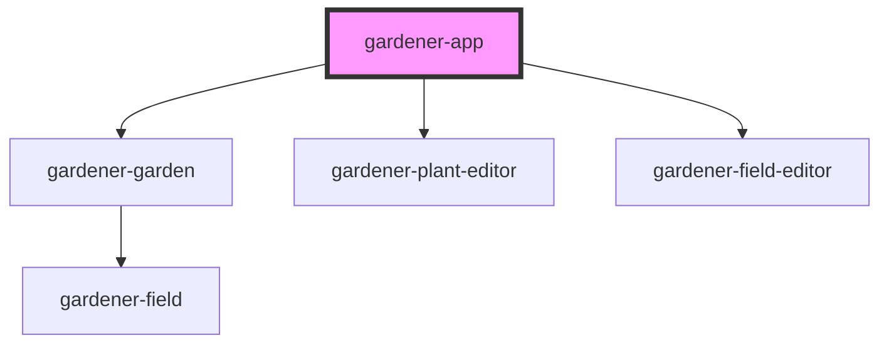

# gardener-app

<!-- Auto Generated Below -->

## Properties

| Property | Attribute | Description | Type      | Default |
| -------- | --------- | ----------- | --------- | ------- |
| `mock`   | `mock`    |             | `boolean` | `false` |

## Dependencies

### Depends on

- [gardener-garden](../gardener-garden)
- [gardener-plant-editor](../gardener-plant-editor)
- [gardener-field-editor](../gardener-field-editor)

### Graph

----------------------------------------------

*Built with [StencilJS](https://stenciljs.com/)*
