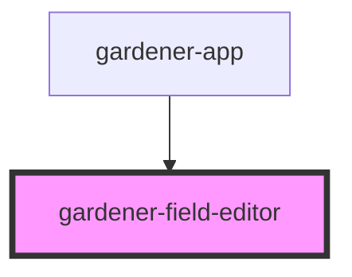

# gardener-field-editor

<!-- Auto Generated Below -->

## Properties

| Property  | Attribute  | Description | Type      | Default     |
| --------- | ---------- | ----------- | --------- | ----------- |
| `fieldId` | `field-id` |             | `number`  | `undefined` |
| `garden`  | --         |             | `Garden`  | `undefined` |
| `plants`  | --         |             | `Plant[]` | `undefined` |

## Events

| Event        | Description | Type                       |
| ------------ | ----------- | -------------------------- |
| `clearField` |             | `CustomEvent<any>`         |
| `save`       |             | `CustomEvent<GardenField>` |

## Dependencies

### Used by

 - [gardener-app](../gardener-app)

### Graph

----------------------------------------------

*Built with [StencilJS](https://stenciljs.com/)*
