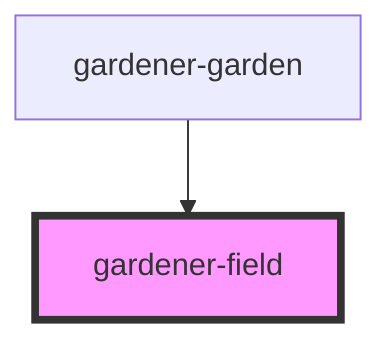

# gardener-field

<!-- Auto Generated Below -->

## Properties

| Property | Attribute | Description | Type          | Default     |
| -------- | --------- | ----------- | ------------- | ----------- |
| `field`  | --        |             | `GardenField` | `undefined` |
| `plants` | --        |             | `Plant[]`     | `undefined` |

## Events

| Event         | Description | Type               |
| ------------- | ----------- | ------------------ |
| `selectField` |             | `CustomEvent<any>` |

## Dependencies

### Used by

 - [gardener-garden](../gardener-garden)

### Graph

----------------------------------------------

*Built with [StencilJS](https://stenciljs.com/)*
