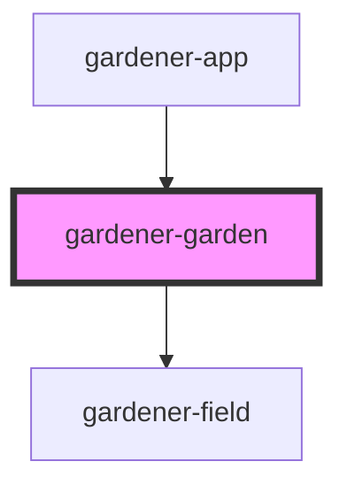

# gardener-garden

<!-- Auto Generated Below -->

## Properties

| Property | Attribute | Description | Type            | Default     |
| -------- | --------- | ----------- | --------------- | ----------- |
| `fields` | --        |             | `GardenField[]` | `undefined` |
| `plants` | --        |             | `Plant[]`       | `undefined` |
| `size`   | `size`    |             | `number`        | `undefined` |

## Events

| Event         | Description | Type                  |
| ------------- | ----------- | --------------------- |
| `reload`      |             | `CustomEvent<any>`    |
| `selectField` |             | `CustomEvent<number>` |

## Dependencies

### Used by

 - [gardener-app](../gardener-app)

### Depends on

- [gardener-field](../gardener-field)

### Graph

----------------------------------------------

*Built with [StencilJS](https://stenciljs.com/)*
