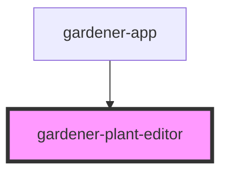

# gardener-plant-editor

<!-- Auto Generated Below -->

## Properties

| Property | Attribute | Description | Type      | Default |
| -------- | --------- | ----------- | --------- | ------- |
| `plants` | --        |             | `Plant[]` | `[]`    |

## Events

| Event  | Description | Type                 |
| ------ | ----------- | -------------------- |
| `save` |             | `CustomEvent<Plant>` |

## Dependencies

### Used by

 - [gardener-app](../gardener-app)

### Graph

----------------------------------------------

*Built with [StencilJS](https://stenciljs.com/)*
